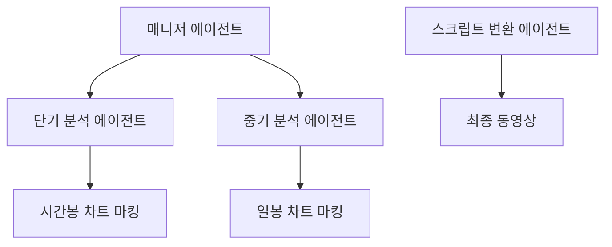
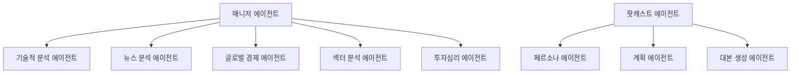

# AI 주식 분석 콘텐츠 생성 시스템

AI 멀티 에이전트를 활용하여 주식을 분석하고 팟캐스트 및 분석 동영상을 자동 생성하는 시스템입니다.

## 🎯 시스템 개요

본 시스템은 두 가지 주요 모듈로 구성되어 있습니다:

### 📊 주식 분석 동영상 생성 (`stock_analysis_video.py`)
- **단기/중기 분석**: 시간봉/일봉 차트를 활용한 트레이딩 및 투자 관점 분석
- **차트 시각화**: 기술적 분석 내용에 맞는 차트 이미지 자동 생성
- **동영상 제작**: AI 음성과 차트 이미지를 결합한 자막 포함 분석 동영상

### 🎙️ 주식 분석 팟캐스트 생성 (`stock_podcast.py`)
- **종합 분석**: 5개 전문 영역의 멀티 에이전트 협업
- **팟캐스트 제작**: 두 명의 진행자가 대화하는 형식의 오디오 콘텐츠
- **다양한 길이**: 3분/10분 버전 선택 가능

## 🚀 주요 기능

### 동영상 생성 시스템
- ✅ **멀티 타임프레임 분석**: 단기(시간봉) + 중기(일봉) 분석
- ✅ **자동 차트 마킹**: 분석 내용에 따른 기술적 지표 표시
- ✅ **AI 음성 합성**: OpenAI TTS를 활용한 자연스러운 음성
- ✅ **자막 생성**: 한글 자막이 포함된 분석 동영상
- ✅ **FFmpeg 통합**: 고품질 비디오 및 자막 처리

### 팟캐스트 생성 시스템
- ✅ **5개 전문 에이전트**: 기술적 분석, 뉴스, 글로벌 경제, 섹터, 투자심리
- ✅ **캐릭터 기반 대화**: 차별화된 두 명의 진행자 페르소나
- ✅ **3단계 스크립트 개선**: 초안 → 10분 버전 → 3분 버전
- ✅ **멀티보이스**: 남성/여성 목소리 교대로 자연스러운 대화
- ✅ **실시간 웹 검색**: 최신 주식 정보 및 뉴스 반영

## 📁 파일 구조

```
stock_analysis_video/
├── examples/open_deep_research/
│   ├── stock_analysis_video.py    # 동영상 생성 메인 시스템
│   ├── stock_podcast.py           # 팟캐스트 생성 메인 시스템
│   ├── scripts/                   # 전문 도구 및 에이전트
│   │   ├── stock_analysis_short.py    # 단기 분석 도구
│   │   ├── stock_analysis_mid.py      # 중기 분석 도구
│   │   ├── stock_visualization_tool.py # 차트 시각화 도구
│   │   ├── sentiment_tool.py          # 감정 분석 도구
│   │   └── text_web_browser.py        # 웹 브라우저 도구
│   └── prompts/                   # AI 프롬프트 템플릿
│       ├── stockvideo_prompts.py      # 동영상용 프롬프트
│       └── podcast_prompts.py         # 팟캐스트용 프롬프트
```

## ⚙️ 설치 및 설정

### 1. 환경 설정
```bash
pip install -r requirements.txt
```

### 2. API 키 설정 (.env 파일)
```env
ANTHROPIC_API_KEY=your_anthropic_key
OPENAI_API_KEY=your_openai_key
HF_TOKEN=your_huggingface_token
SERPAPI_API_KEY=your_serpapi_key
```

### 3. 시스템 요구사항
- Python 3.8+
- FFmpeg (동영상 자막 처리용)
- 충분한 디스크 공간 (임시 파일 생성)

## 🎮 사용법

### 주식 분석 동영상 생성
```bash
python stock_analysis_video.py "삼성전자 주식 분석해"
```

**출력**: `investment_analysis_video.mp4` (자막 포함 분석 동영상)

### 주식 분석 팟캐스트 생성
```bash
# 3분 팟캐스트 (기본)
python stock_podcast.py "애플 주식에 대해 분석하고 투자 의견도 말해줘"

# 10분 팟캐스트
python stock_podcast.py "테슬라 주식에 대해 분석해" --podcast-length 2
```

**출력**: `podcast_final.mp3` (두 진행자 대화형 오디오)

## 🤖 에이전트 구조

### 동영상 시스템 에이전트



- **매니저 에이전트**: 단기/중기 분석 조율
- **단기 분석 에이전트**: 시간봉 기반 트레이딩 분석
- **중기 분석 에이전트**: 일봉 기반 투자 분석
- **차트 마킹 에이전트**: 분석 내용 시각화
- **스크립트 변환 에이전트**: 음성용 텍스트 최적화

### 팟캐스트 시스템 에이전트



- **5개 전문 분석 에이전트**: 각 영역별 심층 분석
- **페르소나 에이전트**: 진행자 캐릭터 설정
- **계획 에이전트**: 팟캐스트 구성 설계
- **대본 생성 에이전트**: 최종 스크립트 제작

## 📤 출력 파일

### 동영상 시스템
- `investment_analysis_video.mp4`: 최종 분석 동영상
- `investment_report.txt`: 텍스트 분석 리포트

### 팟캐스트 시스템
- `podcast_final.mp3`: 최종 팟캐스트 오디오
- `investment_report.txt`: 분석 리포트

## 🔧 커스터마이징

### 분석 주기 변경
```python
# stock_analysis_short.py에서 시간봉 주기 조정
period = "1d"  # 1일 → 5일로 변경 가능
interval = "1h"  # 1시간 → 30분으로 변경 가능
```

### 음성 설정 변경
```python
# 팟캐스트 음성 변경
voices = ["nova", "onyx"]  # alloy, echo, fable, shimmer 등으로 변경 가능
```

### 에이전트 단계 수 조정
```python
max_steps = 10  # 더 상세한 분석을 위해 증가 가능
```

---
*AI 기반 주식 분석 콘텐츠 자동 생성 시스템 v1.0*
